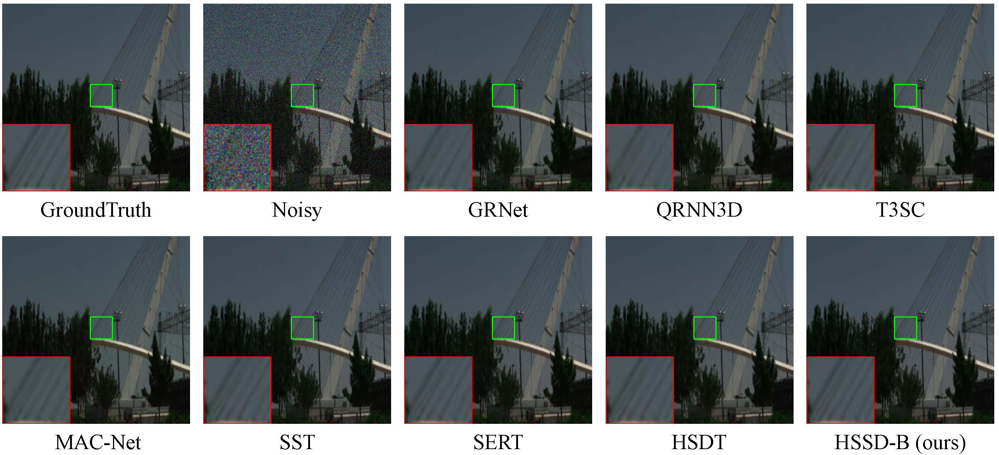
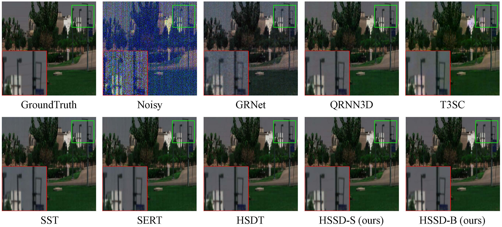

## Pytorch implementation of HSSD
Hybrid Spatial-spectral Neural Network for Hyperspectral Image Denosing
### Gaussian Noise Denoising
```python
python test_icvl_gaussian.py --arch=proposed_base_icvl --device='cuda' --index=1 --ckpt=model_zoo/proposed_dw/icvl_gaussian_base.ckpt --save_dir=./results/proposed_base

```


### Complex Noise Denoising
```python
python test_icvl_complex.py  --arch=proposed_base_icvl --device='cuda' --index=0 --ckpt=model_zoo/proposed_dw/icvl_complex_base.ckpt --save_dir=./results/proposed_base

```

### Realistic Denoising

```python
python test_realistic.py  --arch=proposed_base_real --device='cuda' --index=0 --ckpt=model_zoo/proposed_dw/realistic_base.ckpt --save_dir=./results/proposed_base
```

### Model Zoo
All trained model parameter files can be found on [Google Drive](https://drive.google.com/drive/folders/1zShqvt6_iNNA7kT4UOI4Op8zI796BRF5).

### Test Data

| ICVL iid Gaussian noise    | ICVL Complex Noise    | Realistic Dataset    |
| ---- | ---- | ---- |
| [Baidu Drive from SST](https://pan.baidu.com/s/1GqjTFCtNJkkqG4ENyNUFhQ?pwd=azx0)    |  [BaiDu Drive from SST](https://pan.baidu.com/s/1GqjTFCtNJkkqG4ENyNUFhQ?pwd=azx0)   | [Google Drive](https://drive.google.com/drive/folders/1CRGCTok8v8rzyH25DO6Ogp7219NFWzAJ)   |

